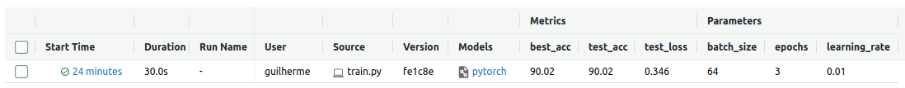

# MLFlow Tutorial

Este repositório contém um passo a passo que aborda os principais recursos do MLFlow e foi baseado em um [tutorial](https://mlflow.org/docs/latest/tutorials-and-examples/tutorial.html) da documentação oficial da ferramenta.
___
## Passo a passo

### Materiais

A pasta `scripts` é composta por alguns scripts que nos auxiliarão na realização do tutorial. Abaixo temos uma descrição de cada um deles:

* [dataset.py](scripts/dataset.py): Contém a função que carrega os dataloaders que servirão para treinar e testar o modelo.
* [model.py](scripts/model.py): Contém a função que cria o modelo.
* [train.py](scripts/train.py): Script principal com a função de treino do modelo. É dentro deste script que logamos as métricas e os parâmetros com o MLFlow tracking.
* [predict.py](scripts/predict.py): Script que carrega e faz inferência usando o modelo treinado.
* [request.py](scripts/request.py): Script que faz uma requisição para a API que está servindo o modelo.

Antes de seguir com o tutorial lembre-se de instalar os pacotes necessários:
    
```bash
pip install -r requirements.txt
```

### 1. MLFlow Tracking

O MLFlow tracking é um componente que permite ao usuário criar e gerenciar experimentos. Fornece uma API e uma interface de usuário que nos permite salvar e visualizar métricas, parâmetros, modelos e artefatos.

Os resultados dos experimentos realizados com MLFlow são armazenados localmente ou em um servidor remoto. Por padrão, os resultados são armazenados localmente em arquivos dentro do diretório `mlruns`.

Para mais informações, consulte a [documentação](https://mlflow.org/docs/latest/tracking.html).

#### 1.1. Treinando um modelo

Primeiramente vamos começar treinando uma simples rede neural com o pytorch, para isso basta rodar o script train.py:

```bash
$ python scripts/train.py <epochs> <learning_rate> <batch_size>
```

Dentro do train.py você encontrará o seguinte trecho de código:

```python
with mlflow.start_run():
    mlflow.log_param("learning_rate", learning_rate)
    mlflow.log_param("batch_size", batch_size)
    mlflow.log_param("epochs", epochs)

    for t in range(epochs):
        print(f"Epoch {t+1}\n-------------------------------")
        train(train_dataloader, model, loss_fn, optimizer)
        test_acc, test_loss = test(test_dataloader, model, loss_fn)

        mlflow.log_metric("test_acc", test_acc, step=t)
        mlflow.log_metric("test_loss", test_loss, step=t)

        if test_acc > best_acc:
            best_acc = test_acc
            mlflow.log_metric("best_acc", best_acc, step=t)
            mlflow.pytorch.log_model(model, "model", signature=signature)
```

Neste trecho de código você pode observar que os parâmetros são logados com o método `log_param`, as métricas são logadas com o método `log_metric` e o modelo é salvo com o método `log_model`. Além destes, temos outros métodos muito úteis que podem ser utilizados por exemplo, `log_artifact` para salvar arquivos no diretório `artifacts` e `log_image` para salvar imagens. Para mais informações, consulte a [documentação](https://mlflow.org/docs/latest/python_api/mlflow.tracking.html).


#### 1.2. Visualizando os resultados

Após o treino, o script irá criar uma pasta chamada `mlruns` no diretório atual. Dentro desta pasta serão armazenados os arquivos de log do experimento. O MLFlow disponibiliza uma interface de usuário que nos permite visualizar os resultados do experimento. Para isso, basta abrir o terminal e digitar:

```bash
$ mlflow ui
```

Agora em um navegador podemos acessar a interface de usuário do MLFlow no endereço [http://127.0.0.1:5000](http://127.0.0.1:5000).

Você verá uma tabela com os resultados do experimento similar a esta:



Selecionando o experimento desejado você terá acesso aos gráficos e artefatos gerados durante o treinamento do modelo.

### 2. MLFlow Projects

Agora que nós temos nosso código de treino, podemos criar um projeto em um formato que seja reproduzível em qualquer plataforma usando o MLFlow Projects. Esse tipo de projeto é útil caso você queira treinar um modelo em cloud por exemplo, no databricks.

#### 2.1. Preparando o MLproject

Para criarmos um novo projeto devemos adicionar um arquivo chamado `MLproject` que deverá conter as especificações do projeto.

```python
name: Tutorial Project

# Caso queira usar o conda:
# conda_env: conda.yaml

# No nosso caso usaremos um python env
python_env: python_env.yaml

entry_points:
  main:
    parameters:
      epochs: {type: int, default: 3}
      learning_rate: {type: float, default: 0.01}
      batch_size: {type: int, default: 64}
    command: "python scripts/train.py {epochs} {learning_rate} {batch_size}"
```

Para mais informações sobre as especificações do arquivo `MLproject` veja [aqui](https://mlflow.org/docs/latest/projects.html).

#### 2.2. Rodando nosso projeto


Podemos rodar com o nosso projeto no env local ou deixar o mlflow preparar um env para o nosso projeto usando o `pyenv`. Caso queria usar o `pyenv` veja [esse passo a passo](https://dev.to/womakerscode/instalando-o-python-com-o-pyenv-2dc7) de como instala-lo.

Para rodar o projeto com o pyenv, basta executar o comando:

```bash
$ mlflow run git@github.com:esgario/mlflow-tutorial.git -P epochs=5 -P learning_rate=0.01 -P batch_size=64
```
Ou com o env local:
```bash
$  mlflow run git@github.com:esgario/mlflow-tutorial.git --env-manager=local
```
>Note que os parâmetros são opcionais, para passar os parâmetros basta colocar o argumento `-P` seguido do nome do parâmetro e o valor desejado.


### 3. MLFlow Models e Model Registry

O **MLFlow Models** consiste em um formato padrão para empacotamento de modelos de aprendizado de máquina. O formato define uma convenção que permite salvar modelos de diferentes frameworks que podem eventualmente serem servidos ou deployados. Mais informações [aqui](https://mlflow.org/docs/latest/models.html).

O **Model Registry** introduz alguns conceitos que facilitam a gestão do ciclo de vida de um modelo de machine learning com o MLFlow. Basicamente os modelos logados recebem um nome, uma versão e uma tag que indica o estágio atual do modelo por exemplo, `Staging`, `Production` ou `Archived`. Além disso, o model registry fornece uma forma de mantermos o tracking da linhagem do modelo, ou seja, mantém um registro de qual experimento gerou determinado modelo.

Neste exemplo nós mostramos como registrar um modelo e carrega-lo para predição usando o MLFlow Models e o Model Registry. 

>**Importante**: Devemos nos atentar que a utilização do Model Registry requer que o armazenamento seja feito em um banco de dados. Portanto, utilizaremos o SQLite durante a execução deste tutorial.

#### 3.1. Treinando um modelo e logando os resultados no SQLite.

Para treinar o modelo utilizaremos o mesmo script de antes. Com a diferença de que agora nós exportaremos uma variável de ambiente com a URI que apontará para o nosso banco de dados. Para isso rode os seguintes comandos:

```bash
$ export MLFLOW_TRACKING_URI=sqlite:///mlflow.db
$ python scripts/train.py <epochs> <learning_rate> <batch_size>
```

ou então basta rodar o `run.sh` disponível na pasta `scripts`:

```bash
$ bash scripts/run.sh
```

Para visualizar o resultado devemos iniciar a interface do MLFlow, neste caso também devemos passar a URI do nosso banco.

```bash
$ mlflow ui --backend-store-uri sqlite:///mlflow.db --serve-artifacts
```

ou

```bash
$ bash scripts/ui.sh
```

obs: use `mlflow ui` para ambiente de desenvolvimento e `mlflow serve` para ambiente de produção.


#### 3.2. Registrando modelo

Após o modelo ter sido logado, nós podemos criar um registro do modelo no Model Registry. Esse registro pode ser feito programaticamente ou via interface de usuário. Neste exemplo, vamos utilizar a interface de usuário.

Primeiro, acesse a interface do MLFlow e selecione o experimento que deseja registrar o modelo. Em seguida, clique em `Register Model` e selecione o modelo que deseja registrar. Veja a imagem abaixo:


Uma nova janela aparecerá. Digite o nome do modelo que deseja registrar e clique em `Register`. Neste caso o nome do modelo será `pytorch_simplenn_mnist`.


Pronto, o modelo está registrado.

>Caso tenha dúvidas sobre como realizar esse procedimento acesse [este link](https://mlflow.org/docs/latest/model-registry.html#ui-workflow) para ver um exemplo mais detalhado de como registrar um modelo via interface de usuário.

#### 3.3. Carregando modelo

Para carregar o modelo precisamos do nome e da versão do modelo registrado. Com esses dados em mãos basta chamar o método `load_model` que do framework desejado que o MLFlow buscará automaticamente seu modelo no Model Registry. Por exemplo:

```python
import torch
import mlflow.pytorch

model_name = "pytorch_simplenn_mnist"
model_version = 1

model = mlflow.pytorch.load_model(
    model_uri=f"models:/{model_name}/{model_version}"
)
```

Rode o script `predict.py` para testar o carregamento do modelo.

```bash
$ export MLFLOW_TRACKING_URI=sqlite:///mlflow.db
$ python scripts/predict.py
```

Se tudo correr bem você verá o resultado de inferência do modelo.

>**Importante**: Existem diferentes formas de se passar a URI do modelo, por exemplo, você pode passar uma URI do S3 ou então o caminho completo da pasta do modelo. Para mais exemplos de URI veja [este link](https://mlflow.org/docs/latest/python_api/mlflow.pytorch.html#mlflow.pytorch.load_model).

#### 3.4. Servindo modelo

Por fim podemos servir diretamente um modelo do Model Registry da seguinte forma:

```bash
$ export MLFLOW_TRACKING_URI=sqlite:///mlflow.db
$ mlflow models serve -m "models:/pytorch_simplenn_mnist/1" --env-manager=local --enable-mlserver --port 6000
```

ou apenas

```bash
$ bash scripts/serving.sh
```

#### 3.5. Fazendo deploy local do modelo

[**Importante**] Os comandos a seguir pressupõem que você já tenha instalado o Minikube, o Istioctl e o Kubectl na sua máquina.

```bash
# Iniciando Minikube
$ minikube start

# Instalando o istioctl
$ istioctl install --set profile=demo -y

# Habilita istio injection
$ kubectl label namespace default istio-injection=enabled

# Aplicando o istio gateway que fará o roteamento das requições para os  modelos.
$ kubectl apply -f infra/gateway.yaml

# Cria um namespace para o seldon-system
$ kubectl create namespace seldon-system

# Instala o seldon-core-operator
$ helm install seldon-core seldon-core-operator \
 --repo https://storage.googleapis.com/seldon-charts \
 --set usageMetrics.enabled=true \
 --set istio.enabled=true \
 --namespace seldon-system

# Checa se o seldon controller está rodando
$ kubectl get pods -n seldon-system

# Configura o docker para apontar pro minikube
$ eval $(minikube docker-env)

# Buildando nossa imagem docker com o mlflow
$ bash scripts/build-docker.sh

# Fazendo deploy do nosso modelo no minikube
$ kubectl apply -f infra/deployment.yaml
```

##### Testando o modelo

Em outro terminal crie um tunnel com o minikube para que o load balancer funcione:
  
```bash
$ minikube tunnel
```

Por fim precisamos fazer um port-foward para o ingress na porta 8080.
  
```bash
$ kubectl port-forward -n istio-system svc/istio-ingressgateway 8080:80
```

Pronto! agora já podemos fazer inferência no nosso modelo. Para isso basta rodar o script `request.py` da seguinte forma:

```bash
$ python scripts/request.py kubernetes
```

---
